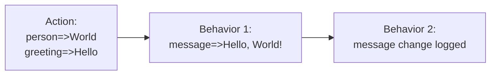
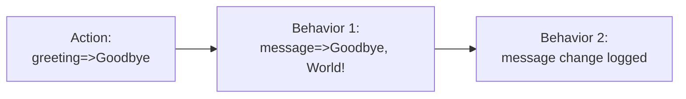
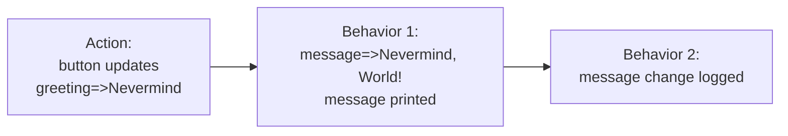

Here we will introduce the essentials to get you started quickly using Behavior Graph.

The recommended way to get started is to use our [preconfigured tutorial site]().

If you prefer to set up your own environment please see the [Getting Started page]().
Make sure to open up the Java console.
That is where we will generate our output.

## Hello, World!

Type in the following into the editor.
You will gain more by typing it, as it compels you to think about each line.

Inside the `Main.java` file add the following lines of code.
We've created the basic outline for you.
(We've combined both classes into the same file to simplify this tutorial.)


import com.yahoo.behaviorgraph.*;

class Main {
  public static void main(String[] args) {

    Graph g = new Graph();
    
    Extent e = new Extent(g);
    
    State<String> person = e.state("Nobody");

    e.behavior()
      .demands(person)
      .runs((ext) -> {
        System.out.println("Hello, " + person.value() + "!");
      });

    e.addToGraphWithAction();

    g.action(() -> {
      person.update("World");
    });
    
  }
}


Run the code.
In the console you should see

```
"Hello, World!"
```


### The Parts

Let's review this in pieces.


import com.yahoo.behaviorgraph.*;


This is a standard Java import.
You may need to adjust it depending on your Java environment which is beyond the scope of this tutorial.
Behavior Graph is available though [Maven Central](https://search.maven.org/artifact/com.yahoo.behaviorgraph/bgjvm).
See the [Getting Started page]() for more information.


Graph g = new Graph();


We put our code directly in `main` to keep this tutorial simple.
You must create an instance of a `Graph`.
You may have more than one instance, but all Behavior Graph elements are associated with a specific instance.


Extent e = new Extent(g);


Next we create an instance of an `Extent`.
Extents are collections of graph elements.
We will use it to create those elements.



State<String> person = e.state("Nobody");


`person` is a __Resource__.
Resources are containers for information.
This specifically is a __State__ resource.
State resources contain persistent information, i.e. it may be used in the future.
You create state resources with the `.state()` factory method on an extent.
State resources always have an initial value.
Our `person` resource has an initial value of `"Nobody"`.


e.behavior()
  .demands(person)
  .runs((ext) -> {
    System.out.println("Hello, " + person.value() + "!");
  });


This is a __Behavior__.
Behaviors are units of functionality.
We create them with the `.behavior()` factory method on an extent that uses a fluent [`BehaviorBuilder`]() API.

This behavior has two parts.
The `.demands()` clause states that this behavior depends on the resource `person`.

The `.runs()` clause is the code that gets run whenever one (or more) of the demands is updated (has new information).
This one prints our greeting using `person.value`.
The `.value` property returns the contents of our `person` state resource.
A behavior must demand a resource in order to access its `.value` property.
(It can also access it if it supplies the resource as well.)


e.addToGraphWithAction();


We have a state resource and a behavior, but they are not part of the graph yet.
Calling `addToGraphWithAction()` takes all the elements that are part of this extent and makes them part of our behavior graph.


g.action(() -> {
  person.update("World");
});


Here we create a new Action using `.action()` on our Graph instance.
Action blocks are how we introduce new information from the outside.
In this case, we are providing the person's name by calling `.update()` on our `person` state resource.

### How it works

This call to `.action()` will start a series of steps.

1. It will run the lambda given as a parameter.
2. `person.update()` will tell the graph to mark any demanding behaviors as activated.
In this case there is the only one demanding behavior.
3. The anonymous function will complete.
4. The graph will call the `runs` block on the one activated behavior.
5. That runs block prints out "Hello, World!" by accessing the `.value()` of `person` which is the value we passed into the `.update()` method.
6. The `.action()` method completes and the program continues.

All of these steps together make up a single Behavior Graph __Event__.

## Doing More

While this may seem like a tedious implementation of "Hello, World", we have already established a foundation that will let this program grow to arbitrary complexity.
The computer can use these components to support us throughout the development process.

Let's introduce a second reason why we may need to print our greeting.

_The highlighted lines will always be the new or updated lines_


State<String> person = e.state("Nobody");
State<String> greeting = e.state("Greetings");

e.behavior()
  .demands(person, greeting)
  .runs((ext) -> {
    System.out.println(greeting.value() + ", " + person.value() + "!");
  });


First we create a second state resource, `greeting`.
Then we add `greeting` as an additional demand.
We must add it as a demand because we access its `.value()` getter.
Behavior Graph will raise an error if we do not.
This explicitness is by design.
Finally we modify our message to use `greeting.value()`.

When we run our program now it should produce

```
"Greetings, World!"
```

If we want to get back to our original message we can add more to our action.


g.action(() -> {
  person.update("World");
  greeting.update("Hello");
});


Now we have

```
"Hello, World!"
```

### Multiple Updates

This illustrates an important distinction between Behavior Graph and many reactive libraries.
Our behavior demands multiple resources.
That means whenever either `person` or `greeting` __or both__ update our behavior should run.
However it doesn't run immediately, it is only __activated__.

Inside our action we update both `person` and `greeting`.
Our behavior that demands them will not run until the entire action block has completed.
All updates inside a single action are treated as if they happened at the same time.
This means our behavior runs only once.

We aren't required to update both just because we demand both.
State resources persist their value from action to action.
Let's add an additional action to see this.


g.action(() -> {
  person.update("World");
  greeting.update("Hello");
});
g.action(() -> {
  greeting.update("Goodbye");
});


Now in our console it should print

```
"Hello, World!"
"Goodbye, World!"
```

"World" persisted into the second event. While "Goodbye" replaced the previous greeting.

## Moments

Not all information persists.
Sometimes things just happen.
A button press is a typical example.
We can model this information with __Moment__ resources.


State<String> person = e.state("Nobody");
State<String> greeting = e.state("Greetings");
Moment button = e.moment();

e.behavior()
  .demands(person, greeting, button)
  .runs((ext) -> {
    if (button.justUpdated()) {
      System.out.println(greeting.value() + ", " + person.value() + "!");
    }
  });


First we create a `button` resource.
We create it with a `.moment()` factory method on our Extent instance.
Then we add it to our behavior's list of demands so it runs when `button` updates.

Inside our runs block, we've gated our log statement by checking against `button.justUpdated()`.
This will be true only if some other part of our code called `button.update()` during the same event.

### Press the Button

If you run the program now you will get no output.
This is because we only update the `person` and `greeting` resources and our `log` statement only runs when `button.justUpdated()` is true.

So lets add some additional lines to simulate a button press.


g.action(() -> {
  person.update("World");
  greeting.update("Hello");
});
g.action(() -> {
  greeting.update("Goodbye");
});
g.action(() -> {
  button.update();
});


Now our program outputs:

```
"Goodbye, World!"
```

The first two actions only update the state resources.
Our behavior is run but the `if (this.button.justUpdated())` check prevents anything from happening.
The third action causes the behavior to run as well.
This time the `if` check passes and it logs the message based on prior updates.

Of course they don't need to be in separate actions.


g.action(() -> {
  button.update();
  greeting.update("Nevermind");
});


Will output:

```
"Nevermind, World!"
```

The message changed because both `button` updated as well as `greeting` in that same action.
The order in which they were updated inside the action is irrelevant to any demanding behaviors.
That's one of the main benefits of Behavior Graph, it let's you explicitly define when you do and do not care about sequencing.

## A Graph

With only one behavior, it is difficult to call it a behavior _graph_.
The real power of Behavior Graph comes with the ability to incrementally introduce related functionality.
Behaviors will often depend on information provided by other behaviors.

### Supplies

Imagine, for security sake, that we would like to introduce logging into our "Hello, World" program.


Moment button = e.moment();
State<String> message = e.state(null);

e.behavior()
  .supplies(message)
  .demands(person, greeting, button)
  .runs((ext) -> {
    message.update(greeting.value() + ", " + person.value() + "!");
    if (button.justUpdated()) {
      System.out.println(message.value());
    }
  });


We add a new state resource, `message`, to save the current message.
We add this resource to a new supplies clause of our behavior definition with `.supplies()`.
__Supplies__ are resources that this behavior is solely responsible for.
It means that a behavior can both read a resource's `.value()` and `.update()` it as well.

We call `message.update()` with the text contents of the greeting to save them for later.


A resource can only be supplied by one behavior.
A behavior can supply multiple resources.
It is an error to call `.update()` on a resource inside a behavior if it does not appear in the supplies clause.

Actions can call `.update()` on a resource without specifying that they do so.
Actions cannot `.update()` a resource if it is supplied by a behavior.


### Logging Behavior

We can introduce the logging functionality by adding an additional behavior.


    if (button.justUpdated()) {
      System.out.println(message.value());
    }
  });

e.behavior()
  .demands(message)
  .runs((ext) -> {
    System.out.println("Message changed to: " + message.value());
  });


This new behavior demands `message`.
This means it will run whenever `message` updates.
Our output shows this result:

```
"Message changed to: Hello, World!"
"Message changed to: Goodbye, World!"
"Nevermind, World!"
"Message changed to: Nevermind, World!"
```

As you can see our new logging behavior runs and generates output each time the message changes.

## Events

In Behavior Graph we call a single pass through the graph (from the start of an action to the last output) an [__Event__]().
Our current output is the result of three events.

__First Event:__


__Second Event:__


__Third Event:__


### The Same Event

Every time a resource is updated, it is assigned the current event.
So in the __First Event__ example above, when `person` and `greeting` update, they get pointers to that same event in their `.event` property.
Then when `message` updates in the first behavior it also gets a pointer to this same event.

We can access this event inside any behavior that we demand (or supply).
This can use this to append a timestamp to our log messages.


e.behavior()
  .demands(message)
  .runs((ext) -> {
    System.out.println("Message changed to: " + message.value() + " at " + message.event().getTimestamp());
  });


You should now see something similar to the lines below

```
Message changed to: Hello, World! at 1662685021685
Message changed to: Goodbye, World! at 1662685021788
Nevermind, World!
Message changed to: Nevermind, World! at 1662685021789
```

### What Just Happened?

Using `.justUpdated()` is a powerful tool for organizing our code into related functionality.
We will add additional logging to see how this works.
First we will track when we send the message.


State<String> message = e.state(null);
Moment sentMessage = e.moment();

e.behavior()
  .supplies(message, sentMessage)
  .demands(person, greeting, button)
  .runs((ext) -> {
    message.update(greeting.value() + ", " + person.value() + "!");
    if (button.justUpdated()) {
      System.out.println(message.value());
      sentMessage.update();
    }
  });


We create a moment resource for `sentMessage`.
Sending the message is a one off, not state that persists, so we keep track of that with a moment.
We will be calling `.update()` on `sentMessage` so we need to add it to the list of supplies.
We call `this.sentMessage.update()` right after the `println` call to track when we actually print out our message.

Note that a behavior can supply more than one resource.
This is a common pattern that lets us group related logic together without having to jump through hoops to avoid duplication.

Next we modify our logging message to demand this additional resource.


e.behavior()
  .demands(message, sentMessage)
  .runs((ext) -> {
    if (message.justUpdated()) {
      System.out.println("Message changed to: " + message.value() + " at " + message.event().getTimestamp());
    }
    if (sentMessage.justUpdated()) {
      System.out.println("Message sent: " + message.value() + " at " + sentMessage.event().getTimestamp());
    }
  });


This behavior now demands `sentMessage` which means it will run whenever that resource is updated.
Inside our run block we check to see which resource was updated and generate the correct log message.
It may be the case that either one or both is updated.

You will find yourself using this "what just happened?" pattern in many of your behaviors.

Running your program should looks like this:

```
Message changed to: Hello, World! at 1662687841592
Message changed to: Goodbye, World! at 1662687841693
Nevermind, World!
Message changed to: Nevermind, World! at 1662687841694
Message sent: Nevermind, World! at 1662687841694
```

## Challenge

Can you introduce a single resource that turns on or off our newly added logging?
Try to do this challenge before looking at the answer.

Here's some hints:
* Try adding a state resource.
* You'll need to demand it in a behavior and introduce some additional logic.

### Answer


Moment sentMessage = e.moment();
State<Boolean> loggingEnabled = e.state(true);

e.behavior()
  .supplies(message, sentMessage)
  .demands(person, greeting, button)
  .runs((ext) -> {
    message.update(greeting.value() + ", " + person.value() + "!");
    if (button.justUpdated()) {
      System.out.println(message.value());
      sentMessage.update();
    }
  });

e.behavior()
  .demands(message, sentMessage, loggingEnabled)
  .runs((ext) -> {
    if (loggingEnabled.value()) {
      if (message.justUpdated()) {
        System.out.println("Message changed to: " + message.value() + " at " + message.event().getTimestamp());
      }
      if (sentMessage.justUpdated()) {
        System.out.println("Message sent: " + message.value() + " at " + sentMessage.event().getTimestamp());
      }          
    }
  });


`loggingEnabled` is our new resource.
We want it to persist so we use a state resource.
It defaults to `true` meaning logging is on.

We then need to demand it inside our logging behavior in order to access its `.value` property.
If we try to access `.value` without demanding it, Behavior Graph will raise an error.

We can modify our last action to see it work.


g.action(() -> {
  button.update();
  greeting.update("Nevermind");
  loggingEnabled.update(false);
});


After adding this additional line, running our code looks like this.

```
Message changed to: Hello, World! at 1662688113911
Message changed to: Goodbye, World! at 1662688114015
Nevermind, World!
```

We no longer log the last two messages because logging was turned off in the same action.
Notice how even though `loggingEnabled.update(false)` comes after our updates, we still disable logging for the same event.
If you were to do this without Behavior Graph, using status quo method calls and property updates, you would need to ensure that `loggingEnabled` changes to `false` _before_ the other updates.
It would be a different result if you updated it _after_.
_The ability to remove the hidden complexity that comes with sequencing is a programming superpower._
Behavior Graph gives you this feature for free.

### Ordering Resources

You may notice that although `loggingEnabled` is a demand, we don't actually need it to to be a reason for our logging behavior to run.
We only need to check its `.value`.
Behavior Graph lets us lighten this constraint.


this.behavior()
  .demands(this.message, this.sentMessage, this.loggingEnabled.order())
  .runs(() => {
    if (this.loggingEnabled.value) {
      if (this.message.justUpdated) {


We can add `.order` to any resource inside our demands clause.
When we do this, updating that resource will not activate this behavior.
This can give us some additional accuracy when specifying how our behaviors are linked.

## Complete

Congratulations! You have completed this first tutorial.
You can see the [finished tutorial code here](https://replit.com/@slevin1/Behavior-Graph-Java-Tutorial-1#Main.java_completed) in the `Main.java_completed` file.

While you may feel that there were many new concepts introduced, we have already covered the majority of them.
You will find they come naturally with some practice.
The remaining tutorials give you a taste for how Behavior Graph works inside real interactive programs.
