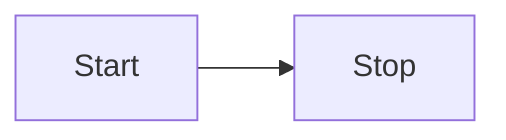

This tutorial will show how Behavior Graph interacts with real inputs and outputs to produce a working application.
In this case we will build the control system for a thermostat, the device in your house that controls the heat.

This simplified thermostat has two buttons, __Up__ and __Down__ for raising and lowering the desired temperature.
It also periodically gets external updates about the current tempterature.
If the desired temperature is above the current temperature, we will turn on the heat.
And once they are the same, the heat will turn off.

## Initial Code

We have created a starter project using [JSFiddle](https://jsfiddle.net/slevin11/k3z2uysx/9/).
You should use that for this tutorial.
It has some simple HTML/CSS to represent the Thermostat's user interface.

Once inside we will type in the setup code we can begin to work from.


import * as bg from "https://cdn.skypack.dev/behavior-graph@beta";

class Thermostat extends bg.Extent {
  constructor(graph) {
    super(graph);
  }
}

let graph = new bg.Graph();
let tm = new Thermostat(graph);
tm.addToGraphWithAction();


The bulk of our application will exist inside our `Thermostat` subclass of `Extent`.

## Desired Temperature

The first part of our logic we will focus on will be setting the desired temperature.
The related elements look something like this.

First we need a state resource to track our desired temeprature and a behavior to supply it.


class Thermostat extends bg.Extent {
  constructor(graph) {
    super(graph);

    this.desiredTemperature = this.state(60);
    this.behavior()
      .supplies(this.desiredTemperature)
      .runs(() => {
      	// desired temperature logic will go here
      });
  }
}


`desiredTemperature` is a state resource with an initial value of 60.
We want a state resource because it is information we intend to use in the future.
Our new behavior supplies this resource because we plan on calling `desiredTemperature.update()` inside the runs block.

### Button Presses

Our thermostat will need to respond to the button press events that come from our HTML buttons.


    super(graph);

    this.up = this.moment();
    document.querySelector('#up').addEventListener('click', () => {
      this.up.updateWithAction();
    });

    this.desiredTemperature = this.state(60);
    this.behavior()
      .supplies(this.desiredTemperature)
      .demands(this.up)
      .runs(() => {
        if (this.up.justUpdated) {
          this.desiredTemperature.update(this.desiredTemperature.value + 1);
        }
      });


We first create an `up` moment resource to track when the up button is pressed.
Then we use standard DOM manipulation code to respond to the HTML Up button being pressed.
We call `this.up.updateWithAction()`;
This line creates a new Action and calls `.update()` which tells Behavior Graph to respond.
It is syntactic sugar for


this.graph.action(() => {
  thi.up.update();
});


We also modify our behavior to respond correctly.
First we add `up` to our list of demands.
This ensures that it will run whenever `up` is updated.
Inside the run block we check for `.justUpdated` and if so we update the `desiredTemperature` by incrementing from its previous `.value`.

Some points to remember:
1. You can only access `.justUpdated` inside behaviors that demand (or supply) that resource.
Otherwise Behavior Graph will raise an error.
2. You can only access `.value` inside behaviors that demand (or supply) that resourse.
Otherwise Behavior Graph will raise an error.
3. You can only call `.update()` inside a behavior that supplies that resource.
A resource can only be supplied by one behavior.
Behavior Graph will raise an error if you do this incorrectly.

These rules are essential to allowing Behavior Graph to ensure your resources are always in a consistent state.

### Output

At this point our `desiredTemperature` does change when you press the Up button in the user interface.
But because we have not generated any output, you cannot tell.


    this.behavior()
      .supplies(this.desiredTemperature)
      .demands(this.up)
      .runs(() => {
        if (this.up.justUpdated) {
          this.desiredTemperature.update(this.desiredTemperature.value + 1);
        }
        this.sideEffect(() => {
          document.querySelector('#desiredTemperature').innerText = this.desiredTemperature.value;
        });
      });


This behavior creates a __Side Effect__ block.
Inside that block we use standard DOM methods to update the temperature.
Now if you run this and click on the Up button you will see the temperature field appear and increment.

Side effects are the correct way to generate output from inside a behavior.
Although a side effect is created inside a behavior it will only run after all needed behaviors have completed running.
This ensures that all our internal state has settled before calling code that may potentially access it.

Side effects do not have a restriction on what resources they can access, unlike the behavior in which they are defined.

### Down

We can add the handling for our Down button


    this.up = this.moment();
    document.querySelector('#up').addEventListener('click', () => {
      this.up.updateWithAction();
    });

    this.down = this.moment();
    document.querySelector('#down').addEventListener('click', () => {
      this.down.updateWithAction();
    });


And modify our behavior to respond.


    this.behavior()
      .supplies(this.desiredTemperature)
      .demands(this.up, this.down)
      .runs(() => {
        if (this.up.justUpdated) {
          this.desiredTemperature.update(this.desiredTemperature.value + 1);
        } else if (this.down.justUpdated) {
          this.desiredTemperature.update(this.desiredTemperature.value - 1);        
        }
        this.sideEffect(() => {


Clicking on the Up and Down buttons should now move the desired temperature display up and down.

### AddedToGraph

You may have noticed that the desired temperature display doesn't show up until after we've tapped on one of the buttons.
This is because our behavior only runs when one of its demands is updated.
What we would like to do is also run it once at the beginning.


    this.behavior()
      .supplies(this.desiredTemperature)
      .demands(this.up, this.down, this.addedToGraph)
      .runs(() => {
        if (this.up.justUpdated) {


We've added `this.addedToGraph` resource to our list of demands.
Now when you run the code you will see that the temperature appears at the beginning.

`addedToGraph` is a built in state resource that is part of every Extent.
It is updated when the Extent is added to the graph.
Just like other resources you can demand it to get a behavior to run at the beginning.
And you can check it's `.justUpdated` property to specialize your logic when necessary.

## Heat

Now we need to introduce a separate bit of functionality to control the heating equipment.
This logic compares the current temperature to the desired temperature and turns on or off the heating equipement accordingly.

### Current Temperature

First we need a resource to track the current temperature.


    this.desiredTemperature = this.state(60);
    this.currentTemperature = this.state(60);


And a behavior to update its display when it changes.


        this.sideEffect(() => {
          document.querySelector('#desiredTemperature').innerText = this.desiredTemperature.value;
        });
      });
      
    this.behavior()
      .demands(this.currentTemperature, this.addedToGraph)
      .runs(() => {
        this.sideEffect(() => {
          document.querySelector('#currentTemperatureDisplay').innerText = this.currentTemperature.value;
        });
      });


Like with `desiredTemperature` this behavior runs whenever `currentTemperature` updates as well as once at the beginning.
It uses a side effect to update our UI.

### Heat On

Next we need a resource to track if the heat is on or not.


    this.desiredTemperature = this.state(60);
    this.currentTemperature = this.state(60);
    this.heatOn = this.state(false);


By default the `heatOn` state resource is false indicating that it is off.


      .runs(() => {
        this.sideEffect(() => {
          document.querySelector('#currentTemperatureDisplay').innerText = this.currentTemperature.value;
        });
      });

    this.behavior()
      .supplies(this.heatOn)
      .demands(this.currentTemperature, this.desiredTemperature)
      .runs(() => {
        let heatOn = this.desiredTemperature.value > this.currentTemperature.value;
        this.heatOn.update(heatOn);
      });


Here we add a new behavior.
It is responsible for updating `heatOn` so we add it as a supply.
It uses both `currentTemperature` and `desiredTemperature` for its logic, so both are demands.
When it runs it updates `heatOn` to true if our `currentTemperature` is too low.

### Heat Display

We want our display to update alongside the `heatOn`.
So we add that logic to our new behavior.


    this.behavior()
      .supplies(this.heatOn)
      .demands(this.currentTemperature, this.desiredTemperature, this.addedToGraph)
      .runs(() => {
        let heatOn = this.desiredTemperature.value > this.currentTemperature.value;
        this.heatOn.update(heatOn);
        this.sideEffect(() => {
          document.querySelector('#heatStatus').innerText = this.heatOn.value ? "On" : "Off"
        });
      });


We demand `addedToGraph` to ensure we update the display when the thermostat starts.
We also add a side effect block to update the UI.

Now when you click the Up and Down buttons you should see the heating display change based on `desiredTemperature` changes.

### Heating Equipment

In a real thermostat, whenever `heatOn` changes, we would send a signal to real heating equipment somewhere else in the house.
Since we don't have that available, we will simulate our own heat and demonstrate how we can mix in other asynchronous elements.


        this.sideEffect(() => {
          document.querySelector('#heatStatus').innerText = this.heatOn.value ? "On" : "Off"
        });
      });

    this.behavior()
      .demands(this.heatOn)
      .runs(() => {
        if (this.heatOn.justUpdatedTo(true)) {
        	// turn heat on
        } else if (this.heatOn.justUpdatedTo(false)) {
        	// turn heat off
        }      
      });


This new behavior respondes to `heatOn` changes.
It uses `.justUpdatedTo()` to differentiate changing to true or false.

At this point we want to make an important point about the way state resoruces work.
Even though the behavior that supplies `heatOn` calls `.update()` every time it runs, it doesn't necessarily update the state resource.
Behavior Graph uses `===` to check if the new value is different from the starting value.
If they are the same the resource does not actually update and demanding behaviors are not activated.

#### Turning On

We can use the built-in Javascript API `setInterval()` to simulate our heat changing over a period of time.
When on, this timer will increment our current temperature by 1 every 1.5 seconds.


        if (this.heatOn.justUpdatedTo(true)) {
          	this.sideEffect(() => {
          		this.heatingIntervalId = setInterval(() => {
              	this.action(() => {
                	this.currentTemperature.update(this.currentTemperature.value + 1);
                });
              }, 1500);
            });
        } else if (this.heatOn.justUpdatedTo(false)) {


This branch creates a side effect which starts the timer and saves that timer directly to a normal property `heatingIntervalId`.
You are always welcome to use normal properties and methods inside Behavior Graph however you like.
You just don't get the additional support from Behavior Graph for those uses.
Here we are just saving the timer so we can cancel it later.
We don't need to respond to any changes with it so we just save it to a property.

When the timer fires, we create an action to bring new information into Behavior Graph.
In this case, the new information is that `currentTemperature` has increased by 1.
Note we are accessing `currentTemperature.value` inside a side effect block which means we don't need to add it as a demand of the behavior.

#### Turning Off


        } else if (this.heatOn.justUpdatedTo(false)) {
          this.sideEffect(() => {
            clearInterval(this.heatingIntervalId);
            this.heatingIntervalId = null;
          });
        }      


This side effect cancels our timer when the heat turns off.
`clearInterval()` is a built-in Javascript method to cancel the timer.
We set the property to null for cleanliness.

Now run the code and turn the desired temperature up a few degrees from the current temperature and wait.
You will see the current temperature slowly increase until they equal and the heat will turn off.

### Events

Should be a diagram

Ok

## Behavior Graph Style

this is how it looks step by step

## Challenge

Add a delay until the heat starts not just a delay to start but also it shouldn't ever start if we go back down







